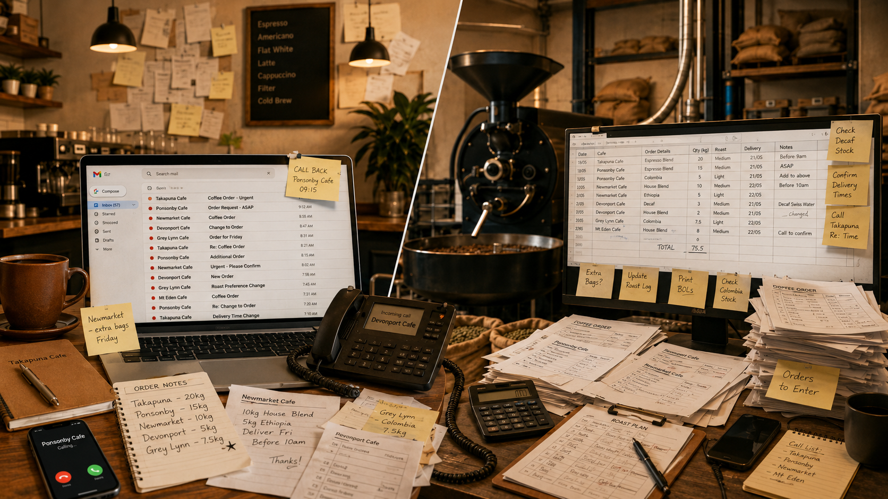
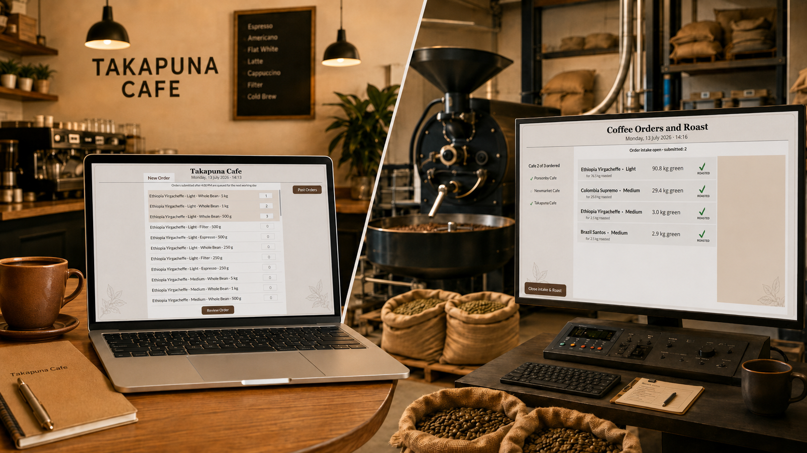
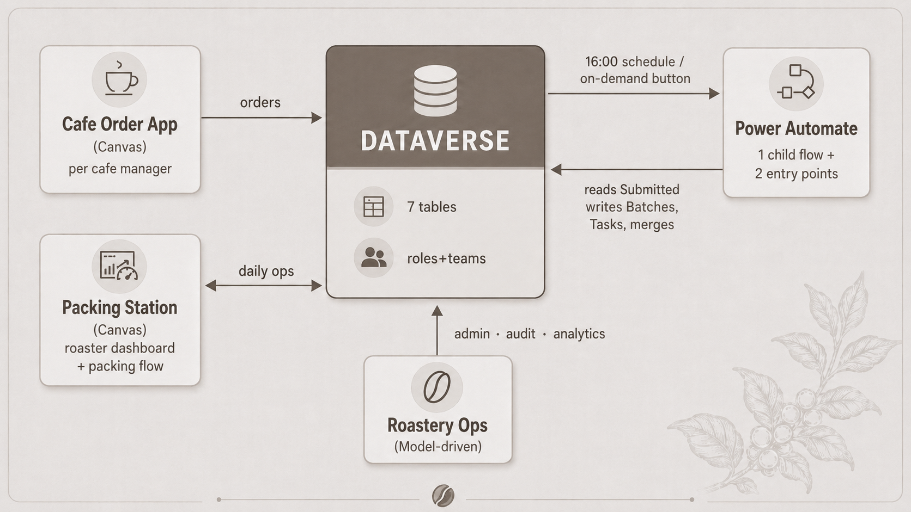
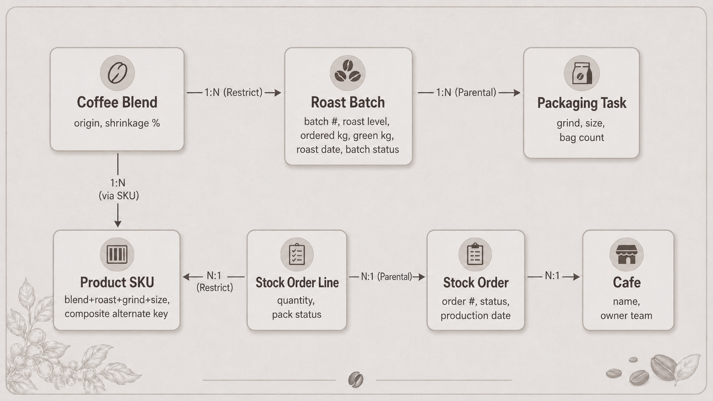
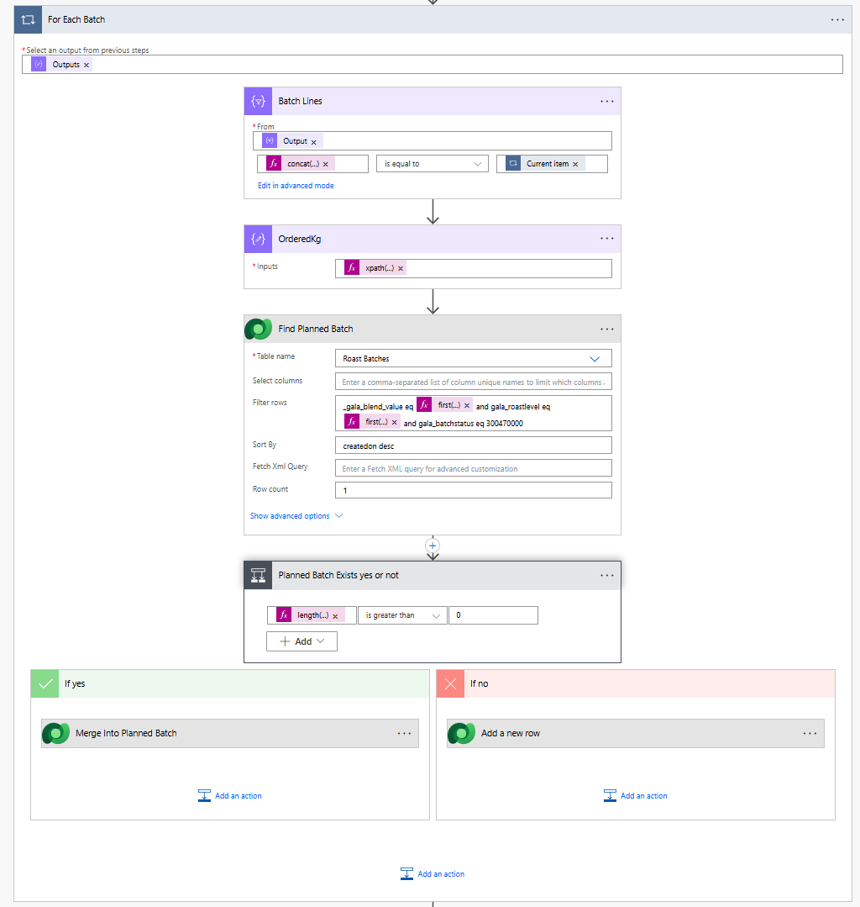
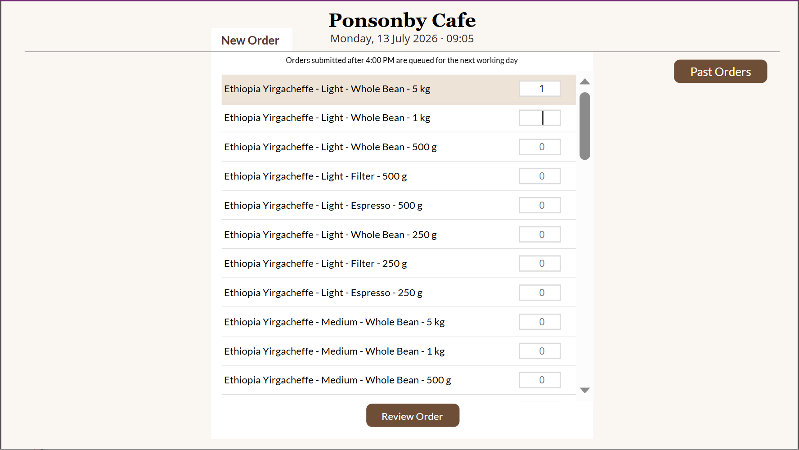
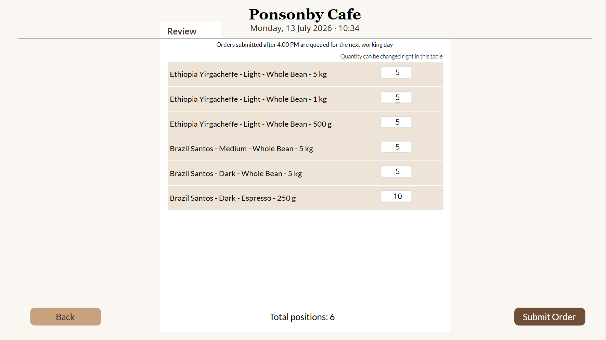
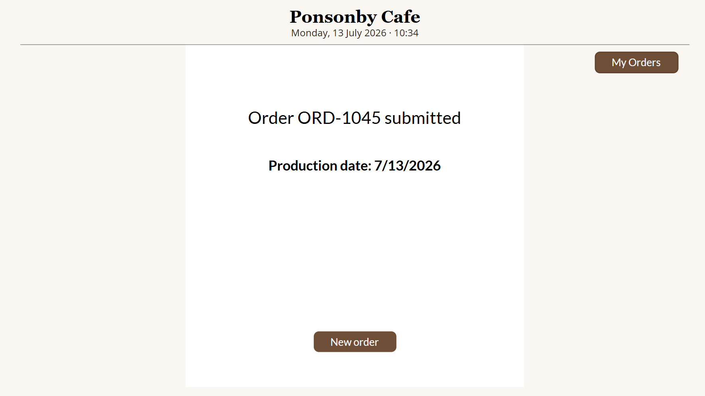
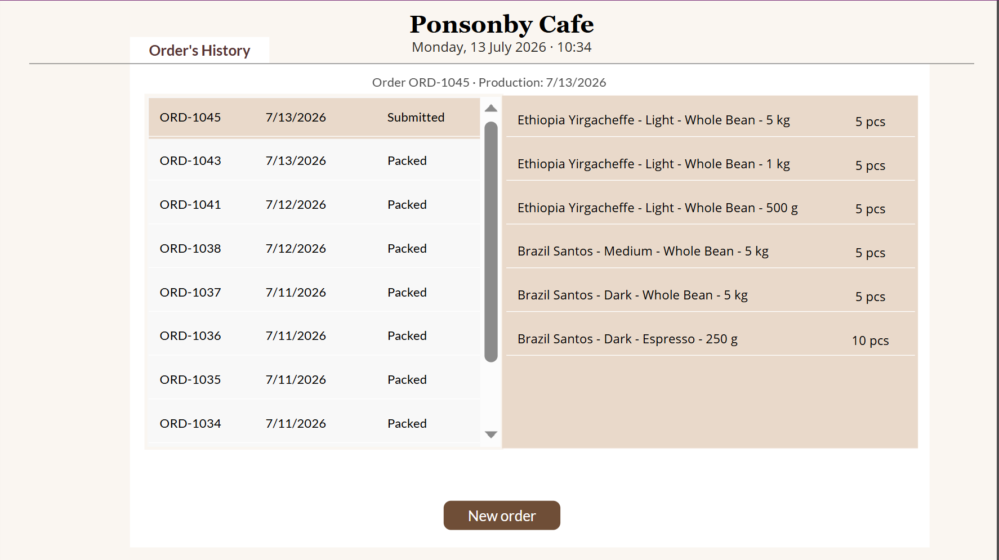
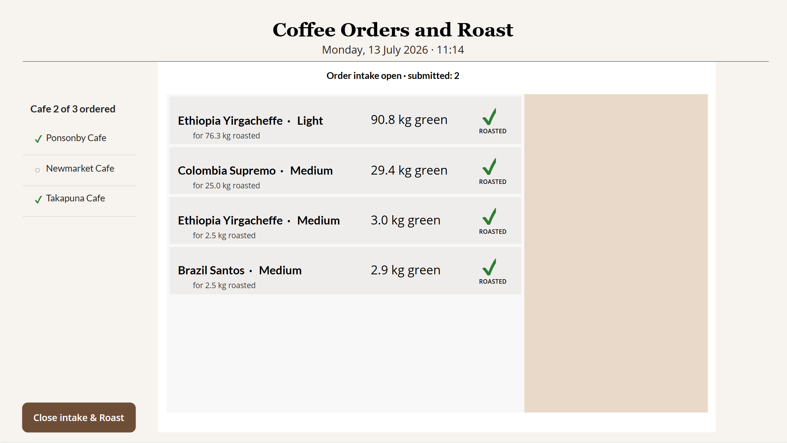

# Coffee Roastery — Order & Production Management System

**Microsoft Power Platform** · Dataverse · Canvas Apps · Model-driven App · Power Automate · Power Fx

A complete order-to-production system for a small coffee roastery supplying it's own cafes : cafe managers place stock orders, the system builds the daily roasting and packaging plan automatically (including green-bean shrinkage math and cross-cafe aggregation), and the roaster works from a single operator dashboard through to packed boxes.

Built end-to-end as a portfolio project: data model, security, automation, three applications, and the design decisions behind them.

---

## Table of contents

- [The business problem](#the-business-problem)
- [What the system does](#what-the-system-does)
- [Architecture](#architecture)
- [Data model](#data-model)
- [Security model](#security-model)
- [Automation](#automation)
- [Applications](#applications)
- [Key design decisions](#key-design-decisions)
- [Environment adaptations](#environment-adaptations)
- [Known limitations & production path](#known-limitations--production-path)
- [Licensing considerations](#licensing-considerations)
- [Repository contents](#repository-contents)

---

## The business problem

A small Auckland roastery supplies three own cafes and plans exspand in the nearest future. Before the system:

- Orders arrived by **phone and text** — easy to mishear, easy to lose.
- The roaster manually totalled all orders to decide how much to roast, converting roasted weight back to **green bean weight** (beans lose ~14–18% during roasting, and the rate differs per origin).
- Cafes phoned to ask "is my order in?", interrupting production.
- A late add-on order meant either a **second drum run** (expensive) or manual recalculation of an existing plan.
- If a day went wrong (roaster sick), unfinished work **silently disappeared** — no one tracked leftovers.

## What the system does



- Cafe managers order from **their own app**  — and see their order history and live status.
- At **16:00 daily** (or earlier, on one tap by the roaster) the system aggregates all orders, groups them into **roasting batches** by blend + roast level, computes green-bean weight per origin shrinkage, and generates the **grind & packaging plan** (bags per grind/size).
- The roaster works from a single dashboard: who ordered, what to roast (in kg of green beans), how to grind and pack it. One tap marks a batch roasted.
- Packing is guided: one order = one box, tap each line as it goes in, **"Box ready" only activates at 100%** — an incomplete box cannot ship. The screen auto-advances to the next box.
- A late add-on order **merges into an existing not-yet-roasted batch** — one drum run instead of two. If roasting has started, the system respects physics and creates a separate batch.
- **Unfinished work from previous days cannot be forgotten**: it appears at the top of the daily worklist with a ⚠ date badge until closed.


---

## Architecture



**Tool choice is per scenario, not per system.** Canvas where the scenario is a purpose-built flow with no standard-UI equivalent (the order matrix; the tap-driven packing checklist). Model-driven where the need is records management — grids, forms, charts, Excel export, all generated from metadata at near-zero cost. A hybrid is the mature answer, not a compromise.

---

## Data model




| Decision | Rationale |
|---|---|
| Custom tables instead of Dynamics Product Catalog / Account | No pricing or billing in scope; sales entities would drag price lists and units into a production domain and obscure the business language ("Cafe", "Stock Order"). Documented revisit trigger: franchise billing. |
| **Alternate keys** on all reference tables | Deterministic upserts; duplicate prevention at platform level rather than duplicate-detection jobs. |
| **Composite alternate key + composite primary name** on Product SKU | One SKU per real-world combination; the primary name renders a complete human-readable line ("Ethiopia Yirgacheffe - Light - Filter - 500 g") everywhere for free. |
| **Parental** cascade Order→Lines, Batch→Tasks; **Restrict** Lines→SKU, Batch→Blend | Deleting a whole removes its parts; deleting a referenced catalog item is blocked. Product retirement = Deactivate, never delete. |
| Shrinkage % stored **per blend** | `green = ordered ÷ (1 − shrinkage/100)`. Shrinkage is a property of the bean, so it lives on the origin. |
| **No batch↔order relationship** | A batch aggregates lines from *many* orders (M:N by nature). Order-level traceability lives where the relationship is direct — the packing screen. A junction table was evaluated and rejected: no business question required it. |


---

## Security model

Two independent layers:

**1. Data layer — security roles + Owner Teams**

| Role | Access |
|---|---|
| `Cafe User` | CRUD on Stock Order / Order Line at **User (Basic)** level with team inheritance; Read on catalog; **no access** to production tables. Each cafe's orders are owned by that cafe's **Owner Team** → managers see only their own cafe (verified by test). |
| `Roaster` | Create/Read/Write **Organization** on Roast Batch & Packaging Task (**no Delete** — production history is never deleted); Read on orders; Read+Write on Order Lines (packing ticks); **Write on Stock Order** scoped to the process need (closing a box) — Create/Delete deliberately not granted. |

**2. Application layer — app-to-role assignment.** Roastery Ops is shared only to `Roaster`. App access narrows the surface but is **not** the security boundary — row-level security holds even if an app link leaks.

**Cafe identity is derived from login, never selected by the user.**

*Least privilege as a living contract: every new writing gesture in the UI triggers a role review, tested under the end user's account — not the maker's.*
Row-level isolation is enforced by security roles and Owner Teams, not by app-side filters — the history gallery deliberately queries the table without a cafe filter. Verified under end-user accounts: a cafe manager sees only their own cafe's orders. (A System Administrator sees all rows by design — security must always be tested under the end user, never under the maker.)

---

## Automation

```
Daily Production Run 16:00  (Recurrence, Auckland TZ) ──┐
                                                        ├──► Generate Production Run (child)
Build Plan (App)  (Power Apps V2 trigger, button)  ─────┘         └─ Respond: "Plan built …"
```

All logic lives in the child flow; the two parents are thin entry points — one implementation, multiple doors. A third door (e.g. an agent) could be added without touching logic.

### Child flow, step by step

1. **TodayNZ** — `convertTimeZone(utcNow(), 'UTC', 'New Zealand Standard Time')`. All date logic is local-calendar based.
2. **List Submitted orders** with `Production Date ≤ TodayNZ`. Orders submitted after the 16:00 cutoff carry the *next business day* (cutoff + weekend skip, set by the order app), so a same-day run naturally ignores them — an explicit business rule: *after 16:00 the drum is running; add-ons roll to the next day*.
3. **List Order Lines** with **Expand Query** to reach Blend and its shrinkage in a single call (no N+1 lookups).
4. **Select** an 11-field flat card per line; everything downstream works from this projection.
5. **Batch grouping** — distinct `blend|roastLevel` keys via the classic `union(x, x)` de-dup; per key: Filter Array → **xpath sum** of kg → *merge-or-create*.
6. **Packaging grouping** — distinct `blend|roast|grind|size` keys; per key: bag-count sum → **Find Batch** → create Packaging Task.
7. **Mark Orders In Production** — the idempotency mechanism: a repeated run finds zero Submitted orders and exits in ~0.5 s.
8. **Respond** — `"Roast groups processed: N, packaging tasks: M"` (counts distinct groups — honest wording whether batches were created or merged).

### Merge logic — batch-level deduplication

**Problem found in acceptance testing:** two build waves in one day (early close + scheduled run), or an unroasted leftover from a previous day, produced duplicate batches for the same blend+roast — two drum runs where one suffices. The core value of the automation was leaking.

**Two valid business rules collided:**
- *Never touch a batch that is already roasting* (physics — beans are in the drum).
- *One blend+roast should be one drum run* (the point of the automation).

**Resolution — the boundary is the physical status:**

```
For each blend|roast key:
    Find Planned Batch = List rows (Roast Batches)
                         filter: blend AND roastLevel AND statuscode = Planned   ← no date filter
                         sort:   createdon DESC, row count 1
    IF found:
        Update row: Ordered Kg = existing + new
                    Green Kg   = (existing + new) ÷ (1 − shrinkage/100)
        → packaging tasks attach to this batch
    ELSE:
        Add row (create a new batch)
```

- **No date filter** — a Planned leftover from *any* previous day is a valid merge target; yesterday's tail absorbs today's demand.
- **Planned only** — Roasting/Done batches are invisible to the merge. Verified: setting a batch to Roasting forced creation of a separate batch.
- **`createdon desc`, row count 1** in the packaging lookup — tasks always land on the newest live batch of the key (just created or just merged). This one-line sort also fixed a real defect: with two same-key batches in a day, tasks previously attached to the wrong one.
- **Merge by Update, never delete-and-recreate** — recreation would cascade-delete existing Packaging Tasks (Parental).



### Idempotency, layered honestly

| Layer | Mechanism | Coverage |
|---|---|---|
| Order level | Status flip to *In Production* as the final step | Any repeated **successful** run processes nothing twice (empty rerun ≈ 500 ms) |
| Batch level | Merge into Planned (above) | Two waves a day / leftover tails never duplicate a drum run |
| **Gap (documented)** | Mark Orders is the last step → a run failing **mid-way** leaves orders Submitted with artifacts already created; a rerun duplicates them | Probability low, detection immediate, cleanup cheap. **Production path:** artifact-level existence checks before each Add row, or a claim-first pattern (flip status first, compensate on failure) |

---

## Applications

### Cafe Order App (canvas — cafe managers)

- **Order matrix**: SKU gallery with quantity inputs; quantities held in a collection (patch-on-change); submit filters `Qty > 0`.
- **Zero-trap fix**: inputs default to empty with a "0" hint and echo the stored value back (`If(ThisItem.Qty > 0, Text(ThisItem.Qty), "")`) — the "typed 2, ordered 20" cursor trap is impossible.
- **Submit pipeline**: 16:00 cutoff + weekend skip computes Production Date; order created via Patch; **Owner reassigned to the cafe's team** (data isolation); lines created with `ForAll … As` + GUID lookups.
- **Validation before action**: column-level constraints, submit disabled until valid — errors prevented, not caught.
- **My Orders** — master-detail history with live status (self-service status visibility; this is why a status chatbot was rejected as redundant).
- Live clock beside the cutoff rule, with a state-aware note that switches after 16:00 from *rule* to *fact about this order*.



### Packing Station (canvas — roaster)

- **State-aware dashboard**: status line switches between *intake open · submitted: N* / *no orders yet* / *plan built*; the cafe checklist dims when the day is built and quiet; the build result is stamped — *"Plan built 12 Jul, 18:39 — Roast groups processed: 1, packaging tasks: 6"*.
- **The roast plan is the worklist**: today's batches **plus unfinished batches from previous days**, which surface at the top with a ⚠ date badge. **Exception handling is merged into the daily worklist** — no separate alert zone, no "check the exceptions view" procedure. Same card, same gestures; a closed tail disappears by itself. (A dedicated red zone and a warning banner were both prototyped and rejected: *"what is the operator supposed to do with a notification?"* — the worklist answers that by construction.)
- **Gesture separation** (UX rule formalised during the build): *navigation and transaction never share a hit target*. Tapping a row selects it (shows its packaging plan); the status transaction lives on a dedicated target — the "ROASTED ?" caption + circle, which answers itself on tap ("ROASTED ✔").
- **Close intake & build plan** — visible only when Submitted > 0; confirmation overlay states the consequence; calls the wrapper flow and refreshes.
- **Packing screen**: queue = orders *In Production* (date-independent); one order per screen; quantity-first line layout ("3 × Ethiopia…"); **tap-per-line** writes Pack Status; progress "Packed X of Y"; **Box ready** appears only at 100%, closes the order and auto-advances; finale "All boxes packed ☕".
- **Timer-based polling** keeps the always-open tablet dashboard fresh (canvas has no server push).



### Roastery Ops (model-driven — roaster + office)

What model-driven contributes, and why it earns its place:

- **Machinery from metadata**: sortable/filterable grids, search, Excel export, record forms, charts — none of it hand-built.
- **Views as cheap answers to business questions**: *Today's Roast Batches*, *Today's Packaging Plan* (related-entity filter), *Orders in Production*, **Overdue Batches** (`older than 1 day AND status ≠ Done`) — an exception view that is empty on a healthy day.
- **Charts**: *Ordered Kg by Blend*, *Bags by Package Size* — click-to-filter. (Demo data demonstrates the system's **capability to measure**, not market conclusions.)
- **Customised main form** on Roast Batch + a **Business Rule**: `IF Batch Status = Done THEN Ordered Kg is Business Required` — declarative form logic, no code.

<!-- SCREENSHOT: docs/06-model-driven-chart.png -->

---

## Key design decisions

1. **Custom domain tables over Dynamics sales entities** — with a documented revisit trigger (billing).
2. **Tool per scenario; hybrid by design** — canvas for purpose-built flows, model-driven for records management.
3. **Copilot Studio agent evaluated and rejected** — every candidate user's questions were already served by purpose-built UI (cafes have *My Orders*; the roaster has the dashboard), and external cafes had no viable channel. Adding an agent would duplicate surfaces. (The skill is demonstrated in a separate D365 Customer Service project, where an agent has a native home.)
4. **Merge boundary = physics** — Planned batches absorb new demand; Roasting/Done are untouchable.
5. **Exception surfacing in the worklist**, not in notifications or separate zones.
6. **Per-batch tap confirmation over a bulk "close the day"** — bulk closure by date was designed, then rejected: it would blindly close a second wave nobody had roasted yet. Atomic facts beat batch ceremonies.
7. **Business Process Flow evaluated and rejected** — the process is linear with no stage decisions; a BPF here is ceremony without value.
8. **Security in data, not in app filters** — app-level filtering is UX; row-level security is the boundary.
9. **Validation before action** across both apps — constraints → contracts → DisplayMode/Visible.
10. **KPIs framed as measurement capability**, never fabricated outcomes.

---

## Environment adaptations

Documented as adaptations, not hacks — each with a production path.

| Constraint | Adaptation | Production path |
|---|---|---|
| Choice sets not resolvable in one canvas app (`Value()` conversion failed; `Text() = "label"` comparisons unreliable for writes) | **Status dictionary in OnStart**: capture real choice values positionally over `Choices('Table'.'Column')`; value order frozen as a contract; display via `Text()`, all comparisons/writes via dictionary variables | Delegable direct choice comparison, or a numeric status-code column |
| Date-only columns arrive in canvas as **DateTime at noon** — `= Today()` misses | `Date(Year(d), Month(d), Day(d)) = Today()` in canvas; `convertTimeZone` in flows — one disease, two cures on both sides of the data | Consistent TZ policy per column |
| Non-delegable predicates (label comparisons, date reconstruction, CountRows on full tables) | Accepted at demo scale; reference data snapshotted to collections at start; transactional data always queried live | Delegable predicates; indexed status columns |
| No Teams/Exchange licences in the developer tenant | In-app surfacing (worklist tails, result stamp) carries the safety load | Teams adaptive cards / email on the same triggers |
| Canvas has no server push | Timer-based polling on always-open screens | Power Apps push notifications; model-driven auto-refresh |

---

## Known limitations & production path

- **Mid-run failure idempotency** (see the table above) — the one real gap, with a stated fix.
- **Mixed read-comparison legacy** — early screens use label comparisons, later ones the choice dictionary. It works; consistency would be a refactor.
- **Status reversal** — a roasted batch can only be reopened via the model-driven form (admin path), deliberately not from the operator's tap.
- **Notification channels** — the system surfaces exceptions in the operator's worklist rather than pushing alerts; Teams/email would be added in production.

---

## Licensing considerations

Built on the **Power Apps Developer Plan** (Dataverse included, single-maker environment). A production deployment would need:

- **Per-app or per-user Power Apps licences** for cafe managers and the roaster (three cafes + one operator makes per-app licensing the cheaper path at this scale).
- **Power Automate** — the daily flow runs under Power Platform request limits; the scheduled run is one execution per day, well within a standard entitlement.
- **Dataverse capacity** — the data volume here (orders, batches, tasks) is trivial; base capacity suffices.
- Alternatives evaluated: **Power Pages** for external cafes (external-user licensing) vs. **guest access to a canvas app** — for three known cafes with named managers, canvas + per-app licensing is materially cheaper; Power Pages becomes the answer at 20+ cafes or anonymous ordering.

---

## Repository contents

```
├── README.md                     ← this file
├── solution/
│   ├── CoffeeRoastery_*.zip           unmanaged (source)
│   └── CoffeeRoastery_*_managed.zip   managed (deployable)
└── docs/
    └── screenshots & diagrams
```

**To deploy:** import the managed solution into a Dataverse environment, then configure connection references (Dataverse), assign the two security roles, and create Owner Teams per cafe.

---

*Built by Galina Nelyubova as a portfolio project. Fictional business, real engineering.*
