# Coffee Roastery Operations System

**Microsoft Power Platform · Dataverse · Canvas Apps · Model-driven App · Power Automate**

A Power Platform solution that converts stock orders from three cafés into a consolidated daily roasting and packing plan.

The system gives café managers one place to order stock and gives the roaster a single operational worklist—from green-bean calculations through to completed boxes.

> **Portfolio project:** designed and built end to end, including business analysis, Dataverse architecture, security, automation, applications and production-readiness assessment.

## At a glance

| Business context                                     | Solution                                                |
| ---------------------------------------------------- | ------------------------------------------------------- |
| Three cafés supplied by one roastery                 | One shared Dataverse data platform                      |
| Orders received through email, chat and spreadsheets | A dedicated ordering application for café managers      |
| Production quantities calculated manually            | Automated aggregation and green-bean calculations       |
| Late orders could create duplicate production setups | Planned work absorbs new demand until roasting begins   |
| Unfinished work could be overlooked                  | Incomplete tasks remain in the operator's worklist      |
| Packing relied on manual checks                      | An order cannot be completed until every line is packed |

## What I delivered

I designed and built the solution end to end:

* translated the operating process into requirements and business rules;
* designed the Dataverse schema, relationships and security model;
* built two Canvas Apps and one model-driven application;
* created scheduled and manually triggered Power Automate flows;
* implemented café-level data isolation using security roles and Owner Teams;
* tested operational exceptions, repeated flow runs and late-order scenarios;
* evaluated licensing, build-vs-buy options and the path to production.

## Demo

**1.5-minute walkthrough:** placing an order, building the production plan and packing completed café orders.

[Watch the video demonstration](PASTE-YOUR-YOUTUBE-LINK-HERE)

## Explore the project

* [Business case](docs/coffee-roastery-business-case.md) — commercial context, build-vs-buy analysis and cost comparison.
* [Technical design](docs/technical-design.md) — architecture, data model and design decisions.
* [Automation](docs/automation.md) — grouping, merge logic and idempotency.
* [Security](docs/security.md) — Dataverse roles, Owner Teams and café-level isolation.
* [Production readiness](docs/production-readiness.md) — limitations, environment adaptations and licensing.

## Contents

* [The business problem](#the-business-problem)
* [How the solution works](#how-the-solution-works)
* [Architecture](#architecture)
* [Applications](#applications)
* [Key design decisions](#key-design-decisions)
* [Repository contents](#repository-contents)

---


📊 **[Business case](docs/coffee-roastery-business-case.md)** — the same project for a non-technical reader: what the market offers and what it costs (Cropster, RoastLog, Cin7, Unleashed), where the off-the-shelf options fall short, a five-year cost comparison, and an honest section on where a custom build is the wrong answer.

---

## Table of contents

- [The business problem](#the-business-problem)
- [What the system does](#what-the-system-does)
- [Architecture](#architecture)
- [Technical documentation](#technical-documentation)
- [Applications](#applications)
- [Key design decisions](#key-design-decisions)
- [Repository contents](#repository-contents)

---

## The business problem

A small Auckland coffee company roasts its own beans and runs **three of its own cafes** — the cafe managers are staff, not external customers. The owners plan to open up to **seven sites over five years**. Before the system:

- **Orders were scattered** across email, a group chat and a spreadsheet nobody maintained — read twice, or not at all.
- The roaster manually totalled all orders to decide how much to roast, converting roasted weight back to **green bean weight** (beans lose ~14–18% during roasting, and the rate differs per origin).
- **No single source of truth**: orders arrived by email, group chat, and a shared spreadsheet nobody kept current — no reliable answer to "what exactly are we roasting today?"
- A late add-on order meant either a **second production setup** for the same coffee — reset, re-profile, re-weigh — or a manual recalculation of an existing plan.
- If a day went wrong (illness, equipment, a rush), unfinished work **silently disappeared** — the shortfall surfaced only when a cafe ran out, too late to roast, rest and deliver inside the freshness window.
 
### Why the business runs on short cycles

Roasted coffee has a **peak-freshness window** — it is not "fresher is always better". Beans degas CO₂ for the first few days and brew unpredictably; most coffees peak around **days 5–14**; past ~30 days they oxidise and lose complexity. So the roastery cannot roast a month of stock in advance, and cannot roast tonight for tomorrow morning. It must work in **short repeating cycles**, with cafes ordering **frequently in small quantities**. That is a daily coordination load — and before this system, it was carried by hand.

## The domain math

Green coffee loses **11–24% of its weight** during roasting (moisture, chaff, off-gassing); lighter roasts lose less, darker more, and specialty roasters typically sit in the **11–16%** band. So the roaster cannot weigh out what was ordered: to deliver 30 kg roasted at 16% loss, they must load `30 ÷ (1 − 0.16) = 35.7 kg` of green. This backwards calculation — *how much green do I need for today's orders* — is a real daily manual task, and it is what the automation replaces.

*(Roast-logging software also computes weight loss — but* ***after*** *the roast, from actual green-in/roasted-out weights, for quality control. Planning the green load* ***before*** *the roast, against a day of multi-site orders, is a different job.)*

## What the system does

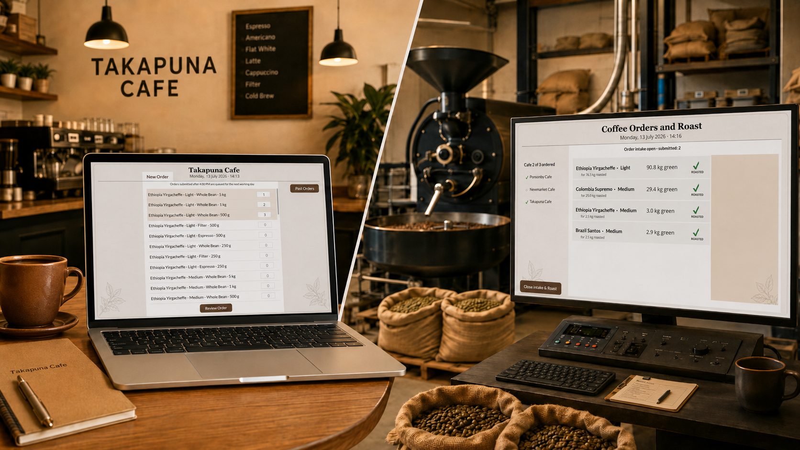

- Cafe managers order from **their own app** — a product grid on tablet/phone — and see their order history and live status.
- At **16:00 daily** (or earlier, on one tap by the roaster) the system aggregates all orders, groups them into **roasting batches** by blend + roast level, computes green-bean weight per origin shrinkage, and generates the **grind & packaging plan** (bags per grind/size).
- The roaster works from a single dashboard: who ordered, what to roast (in kg of green beans), how to grind and pack it. One tap marks a batch roasted.
- Packing is guided: one order = one box, tap each line as it goes in, **"Box ready" only activates at 100%** — an incomplete box cannot ship. The screen auto-advances to the next box.
- A late add-on order **merges into a production task that has not been run yet** — one setup instead of two. If the task has already started, the system respects physics and plans a separate one.
- **Unfinished work from previous days cannot be forgotten**: it appears at the top of the daily worklist with a ⚠ date badge until closed.


---

## Architecture


For the complete architecture, Dataverse data model and design rationale, see the [technical design](docs/technical-design.md).

**Tool choice is per scenario, not per system.** Canvas where the scenario is a purpose-built flow with no standard-UI equivalent (the order matrix; the tap-driven packing checklist). Model-driven where the need is records management — grids, forms, charts, Excel export, all generated from metadata at near-zero cost. A hybrid is the mature answer, not a compromise.

---

## Data model


---
## Technical documentation

- [Technical design](docs/technical-design.md) — architecture, data model and design decisions.
- [Automation](docs/automation.md) — flow structure, grouping, merge logic and idempotency.
- [Security](docs/security.md) — Dataverse roles, Owner Teams and café-level isolation.
- [Production readiness](docs/production-readiness.md) — limitations, environment adaptations and licensing.
  
## Applications

## Demo video

[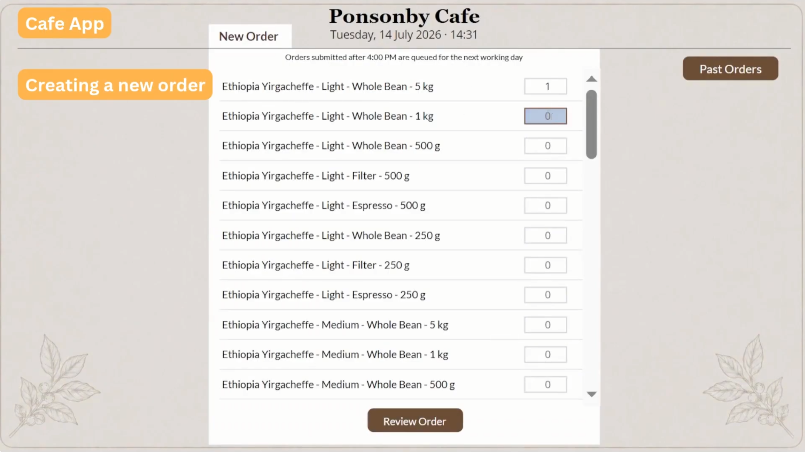](https://youtu.be/m7cRZf3rfo8)

*1,5 -minute walkthrough: placing an order, building the production plan, and packing.*

### Cafe Order App (canvas — cafe managers)

- **Order matrix**: SKU gallery with quantity inputs; quantities held in a collection (patch-on-change); submit filters `Qty > 0`.
- **Zero-trap fix**: inputs default to empty with a "0" hint and echo the stored value back (`If(ThisItem.Qty > 0, Text(ThisItem.Qty), "")`) — the "typed 2, ordered 20" cursor trap is impossible.
- **Submit pipeline**: 16:00 cutoff + weekend skip computes Production Date; order created via Patch; **Owner reassigned to the cafe's team** (data isolation); lines created with `ForAll … As` + GUID lookups.
- **Validation before action**: column-level constraints, submit disabled until valid — errors prevented, not caught.
- **My Orders** — master-detail history with live status (self-service status visibility; this is why a status chatbot was rejected as redundant).
- Live clock beside the cutoff rule, with a state-aware note that switches after 16:00 from *rule* to *fact about this order*.


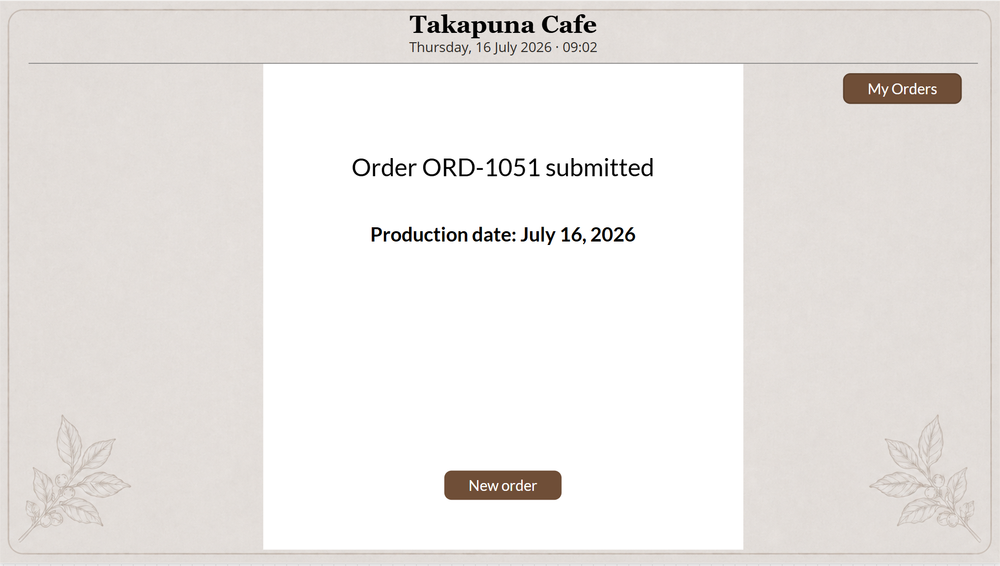


### Packing Station (canvas — roaster)

- **State-aware dashboard**: status line switches between *intake open · submitted: N* / *no orders yet* / *plan built*; the cafe checklist dims when the day is built and quiet; the build result is stamped — *"Plan built 12 Jul, 18:39 — Roast groups processed: 1, packaging tasks: 6"*.
- **The roast plan is the worklist**: today's batches **plus unfinished batches from previous days**, which surface at the top with a ⚠ date badge. **Exception handling is merged into the daily worklist** — no separate alert zone, no "check the exceptions view" procedure. Same card, same gestures; a closed tail disappears by itself. (A dedicated red zone and a warning banner were both prototyped and rejected: *"what is the operator supposed to do with a notification?"* — the worklist answers that by construction.)
- **Gesture separation** (UX rule formalised during the build): *navigation and transaction never share a hit target*. Tapping a row selects it (shows its packaging plan); the status transaction lives on a dedicated target — the "ROASTED ?" caption + circle, which answers itself on tap ("ROASTED ✔").
- **Close intake & build plan** — visible only when Submitted > 0; confirmation overlay states the consequence; calls the wrapper flow and refreshes.
- **Packing screen**: queue = orders *In Production* (date-independent); one order per screen; quantity-first line layout ("3 × Ethiopia…"); **tap-per-line** writes Pack Status; progress "Packed X of Y"; **Box ready** appears only at 100%, closes the order and auto-advances; finale "All boxes packed ☕".
- **Timer-based polling** keeps the always-open tablet dashboard fresh (canvas has no server push).


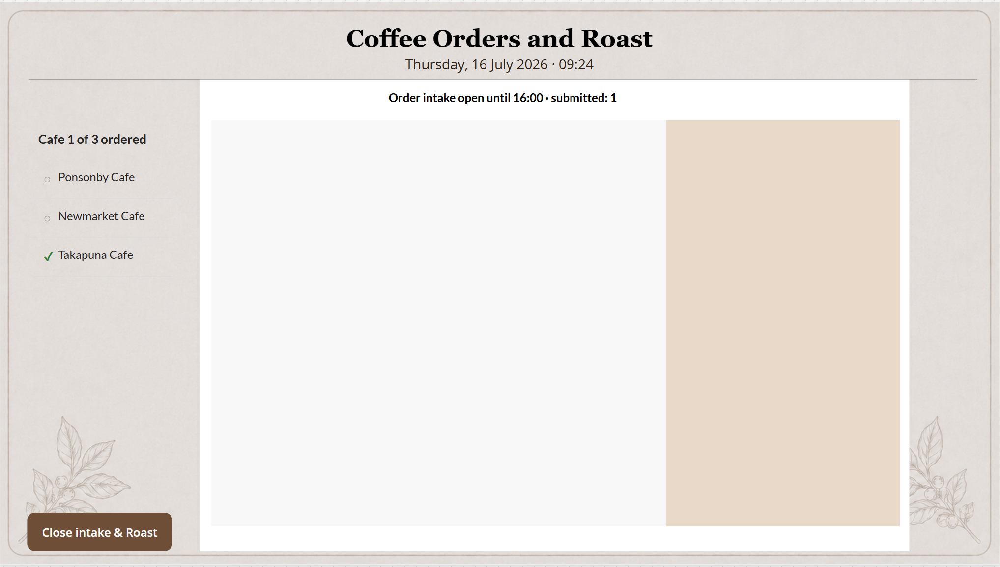

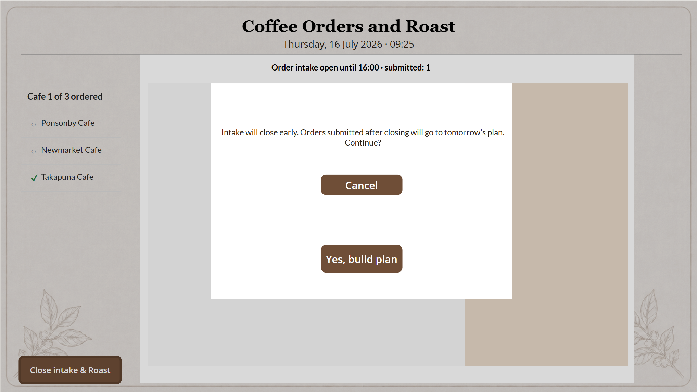
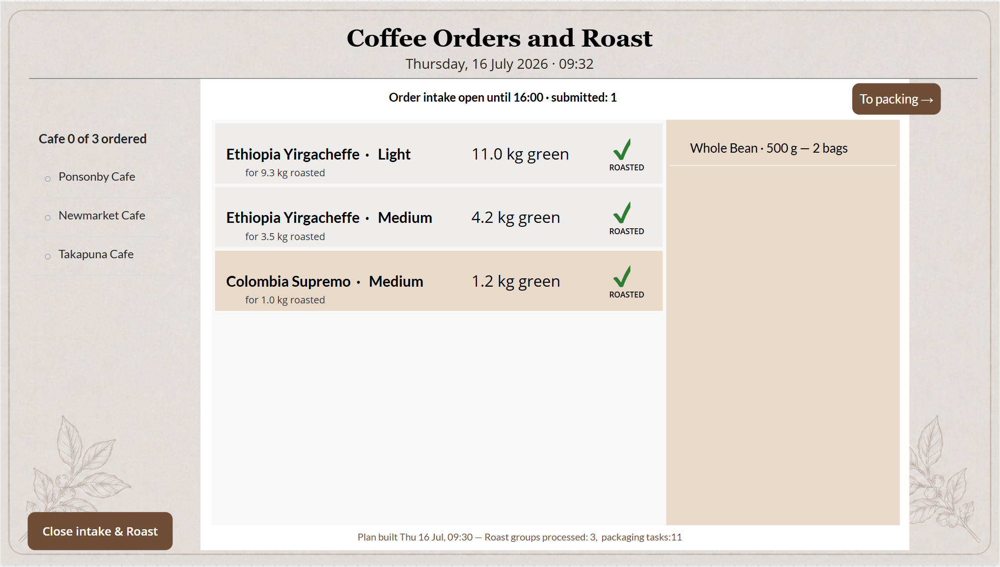
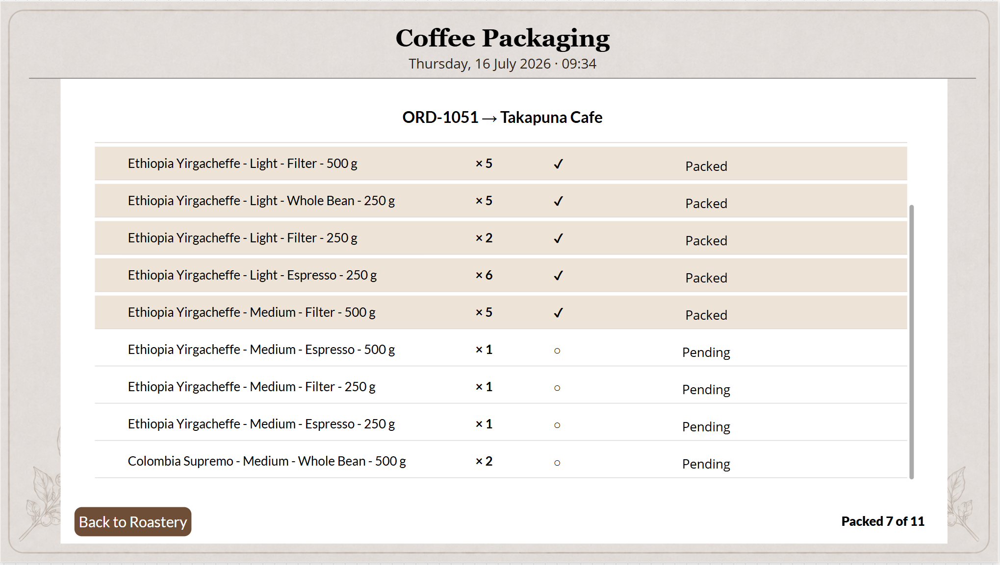
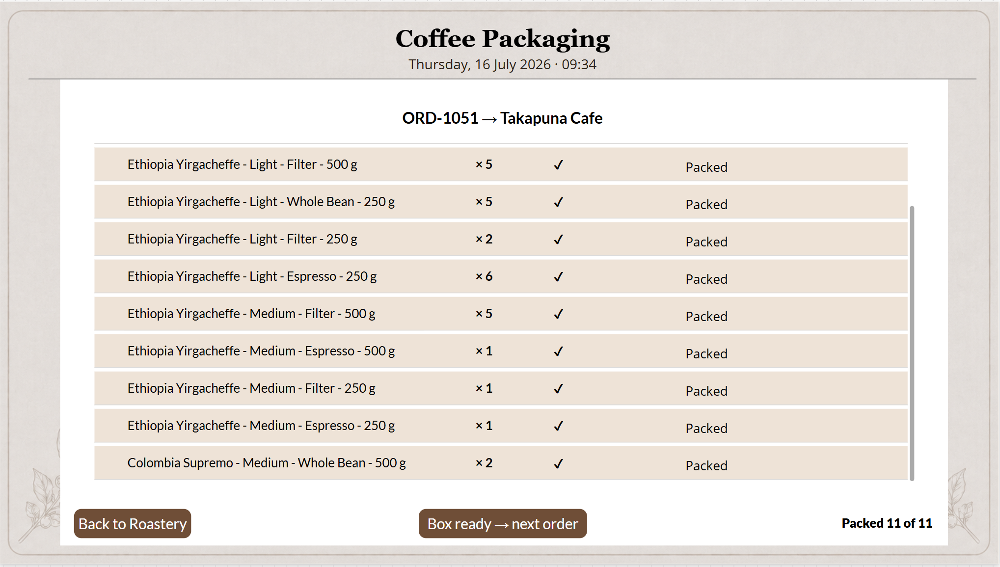
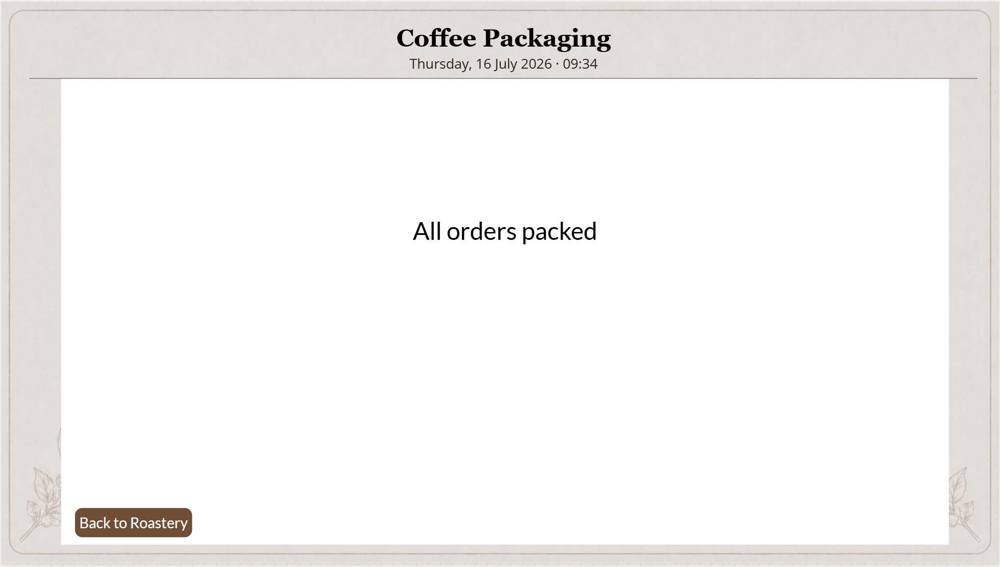
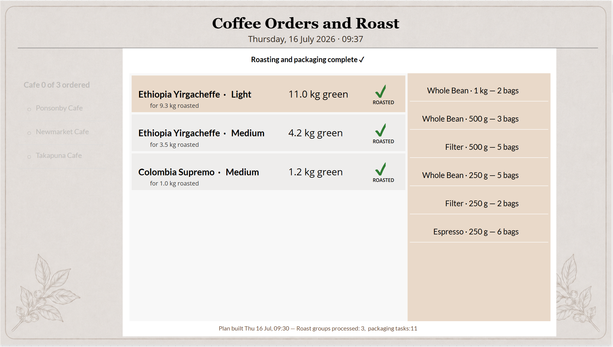
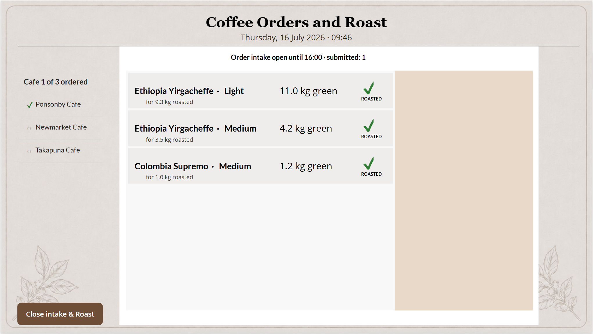

### Roastery Ops (model-driven — roaster + office)

What model-driven contributes, and why it earns its place:

- **Machinery from metadata**: sortable/filterable grids, search, Excel export, record forms, charts — none of it hand-built.
- **Views as cheap answers to business questions**: *Today's Roast Batches*, *Today's Packaging Plan* (related-entity filter), *Orders in Production*, **Overdue Batches** (`older than 1 day AND status ≠ Done`) — an exception view that is empty on a healthy day.
- **Charts**: *Ordered Kg by Blend*, *Bags by Package Size* — click-to-filter. (Demo data demonstrates the system's **capability to measure**, not market conclusions.)
- **Customised main form** on Roast Batch + a **Business Rule**: `IF Batch Status = Done THEN Ordered Kg is Business Required` — declarative form logic, no code.


---

## Key design decisions

1. **Custom domain tables over Dynamics sales entities** — with a documented revisit trigger (billing).
2. **Tool per scenario; hybrid by design** — canvas for purpose-built flows, model-driven for records management.
3. **Copilot Studio agent evaluated and rejected** — every candidate user's questions were already served by purpose-built UI (cafes have *My Orders*; the roaster has the dashboard), and external cafes had no viable channel. Adding an agent would duplicate surfaces. (The skill is demonstrated in a separate D365 Customer Service project, where an agent has a native home.)
4. **Merge boundary = physics** — Planned batches absorb new demand; Roasting/Done are untouchable.
5. **Exception surfacing in the worklist**, not in notifications or separate zones.
6. **Per-batch tap confirmation over a bulk "close the day"** — bulk closure by date was designed, then rejected: it would blindly close a second wave nobody had roasted yet. Atomic facts beat batch ceremonies.
7. **Business Process Flow evaluated and rejected** — the process is linear with no stage decisions; a BPF here is ceremony without value.
8. **Security in data, not in app filters** — app-level filtering is UX; row-level security is the boundary.
9. **Validation before action** across both apps — constraints → contracts → DisplayMode/Visible.
10. **KPIs framed as measurement capability**, never fabricated outcomes.

---
Additional implementation details are documented in the [technical design](docs/technical-design.md). 


---

## Repository contents

```
├── README.md                     ← this file
├── solution/
│   ├── CoffeeRoastery_*.zip           unmanaged (source)
│   └── CoffeeRoastery_*_managed.zip   managed (deployable)
└── docs/
    └── screenshots & diagrams
```

**To deploy:** import the managed solution into a Dataverse environment, then configure connection references (Dataverse), assign the two security roles, and create Owner Teams per cafe.

---

*Built by Galina Nelyubova as a portfolio project. Fictional business, real engineering.*
