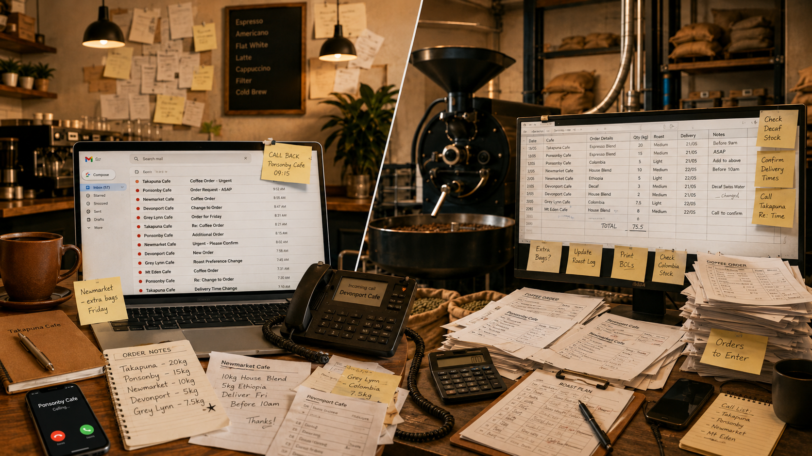

# Coffee Roastery Operations System

**Microsoft Power Platform · Dataverse · Canvas Apps · Model-driven App · Power Automate**

A Power Platform solution that converts stock orders from three cafés into a consolidated daily roasting and packing plan.

The system gives café managers one place to order stock and gives the roaster a single operational worklist—from green-bean calculations through to completed boxes.

> **Portfolio project:** designed and built end to end, including business analysis, Dataverse architecture, security, automation, applications and production-readiness assessment.

## At a glance

| Business context                                     | Solution                                                |
| ---------------------------------------------------- | ------------------------------------------------------- |
| Three cafés supplied by one roastery                 | One shared Dataverse data platform                      |
| Orders received through email, chat and spreadsheets | A dedicated ordering application for café managers      |
| Production quantities calculated manually            | Automated aggregation and green-bean calculations       |
| Late orders could create duplicate production setups | Planned work absorbs new demand until roasting begins   |
| Unfinished work could be overlooked                  | Incomplete tasks remain in the operator's worklist      |
| Packing relied on manual checks                      | An order cannot be completed until every line is packed |

## What I delivered

I designed and built the solution end to end:

* translated the operating process into requirements and business rules;
* designed the Dataverse schema, relationships and security model;
* built two Canvas Apps and one model-driven application;
* created scheduled and manually triggered Power Automate flows;
* implemented café-level data isolation using security roles and Owner Teams;
* tested operational exceptions, repeated flow runs and late-order scenarios;
* evaluated licensing, build-vs-buy options and the path to production.

## Demo

**1.5-minute walkthrough:** placing an order, building the production plan and packing completed café orders.

[Watch the video demonstration](https://youtu.be/m7cRZf3rfo8)
## Explore the project

* [Business case](docs/coffee-roastery-business-case.md) — commercial context, build-vs-buy analysis and cost comparison.
* [Technical design](docs/technical-design.md) — architecture, data model and design decisions.
* [Automation](docs/automation.md) — grouping, merge logic and idempotency.
* [Security](docs/security.md) — Dataverse roles, Owner Teams and café-level isolation.
* [Production readiness](docs/production-readiness.md) — limitations, environment adaptations and licensing.


## Table of contents

- [The business problem](#the-business-problem)
- [How the solution works](#how-the-solution-works)
- [Architecture](#architecture)
- [Applications](#applications)
- [Key design decisions](#key-design-decisions)
- [Repository contents](#repository-contents)
- [Deployment](#deployment)

---
## The business problem


A small Auckland coffee company roasts coffee centrally for three company-owned cafés, with plans to grow to seven locations.

Before the solution:

* orders arrived through email, group chat and spreadsheets;
* the roaster manually combined demand from every café;
* ordered roasted weight had to be converted into the required green-bean weight;
* late additions could cause duplicate production setups;
* unfinished production work could disappear from the next day's plan;
* packing depended on manual checking.

Coffee production also runs on short planning cycles. The roastery cannot simply produce a month of stock in advance, so ordering, roasting and delivery must be coordinated frequently.

### Domain calculation

Coffee loses weight during roasting. To produce **30 kg of roasted coffee** at an expected **16% weight loss**, the system calculates:

```text
Required green weight = 30 ÷ (1 − 0.16) = 35.7 kg
```

The system performs this calculation automatically after consolidating demand from all cafés.

---


## How the solution works

### 1. A café places an order

A café manager selects products and quantities in the Cafe Order App. The café is derived from the signed-in user and cannot be selected manually.

### 2. Order intake is closed

At 16:00—or earlier through a manual action—the system collects submitted orders that are ready for production.

### 3. The production plan is generated

Power Automate groups demand by coffee and roast level, calculates the required green-bean weight and creates the corresponding grinding and packaging tasks.

### 4. The roaster completes the work

The Packing Station presents today's production alongside unfinished work from previous days. Completed roasting tasks are confirmed individually.

### 5. Café orders are packed

Each order is treated as one box. The operator checks every order line, and the box can only be completed when all items have been packed.

### Late-order handling

A late order is merged into an existing production task while that task is still **Planned**. Once roasting has started, the system creates separate work rather than modifying a physical batch already in progress.

---

## Architecture


For the complete architecture, Dataverse data model and design rationale, see the [technical design](docs/technical-design.md).

**Tool choice is per scenario, not per system.** Canvas where the scenario is a purpose-built flow with no standard-UI equivalent (the order matrix; the tap-driven packing checklist). Model-driven where the need is records management — grids, forms, charts, Excel export, all generated from metadata at near-zero cost. A hybrid is the mature answer, not a compromise.

---

## Applications

**1.5-minute walkthrough:** placing an order, building the production plan and packing completed café orders.

[Watch the video demonstration](https://youtu.be/m7cRZf3rfo8)

### Cafe Order App

**For café managers:** place stock orders, review previous orders and track fulfilment status.


The application provides:

* a product matrix designed for quick ordering;
* automatic café identification based on the signed-in user;
* validation before an order can be submitted;
* production-date calculation based on the 16:00 cutoff and weekends;
* order history with live fulfilment status.


### Packing Station

**For the roaster:** generate the production plan, complete roasting work and pack each café order.


The application provides:

* one worklist containing today's production and unfinished work from previous days;
* manual intake closure and production-plan generation;
* individual confirmation of completed roasting tasks;
* a guided packing checklist for each café order;
* automatic prevention of incomplete boxes being closed.


### Roastery Ops

**For operations and administration:** inspect records, maintain reference data and review production reporting.


The model-driven application provides:

* searchable and filterable operational records;
* production, packaging and overdue-work views;
* charts and Excel export;
* record forms and reference-data maintenance;
* an administrative path for reviewing exceptions and production history.

Implementation details and notable Power Fx patterns are documented in the [technical design](docs/technical-design.md).

---

## Key design decisions

### 1. The merge boundary follows the physical process

New demand can be added to a production task while its status is **Planned**.

Once roasting has started, the system does not modify that task. A separate production task is created instead.

This reduces duplicate setups without pretending that physical work already in progress can still be changed.

### 2. Security is enforced in Dataverse

Café-level data isolation is implemented through Dataverse security roles and Owner Teams—not through filters inside the Canvas App.

The café is derived from the signed-in user and cannot be selected manually. This means that data access remains restricted even outside the application's normal screens.

### 3. Exceptions remain in the normal workflow

Unfinished production is not moved to a separate warning screen.

It remains in the roaster's normal worklist with a visible date warning until it is completed. The operator does not need to monitor another dashboard or remember an additional process.

[Read the complete technical rationale](docs/technical-design.md)


---
## Repository contents
```text
├── README.md
├── solution/
│   ├── CoffeeRoastery_*.zip
│   └── CoffeeRoastery_*_managed.zip
└── docs/
    ├── technical-design.md
    ├── automation.md
    ├── security.md
    ├── production-readiness.md
    └── coffee-roastery-business-case.md
```


## Deployment

1. Download the managed solution from the [`solution`](solution/) folder.
2. Import it into a Dataverse environment.
3. Configure the Dataverse connection references.
4. Assign the `Cafe User` and `Roaster` security roles.
5. Create one Owner Team for each café and add the corresponding café managers.
6. Share the applications with the appropriate users and security roles.

Environment-specific considerations are documented in [Production readiness](docs/production-readiness.md).


---

*Built by Galina Nelyubova as a portfolio project. Fictional business, real engineering.*
