# Coffee Roastery Operations System

**Microsoft Power Platform · Dataverse · Canvas Apps · Model-driven App · Power Automate**

A Power Platform solution that converts stock orders from three cafés into a consolidated daily roasting and packing plan.

The system gives café managers one place to order stock and gives the roaster a single operational worklist—from green-bean calculations through to completed boxes.

> **Portfolio project:** designed and built end to end, including business analysis, Dataverse architecture, security, automation, applications and production-readiness assessment.

## At a glance

| Business context                                     | Solution                                                |
| ---------------------------------------------------- | ------------------------------------------------------- |
| Three cafés supplied by one roastery                 | One shared Dataverse data platform                      |
| Orders received through email, chat and spreadsheets | A dedicated ordering application for café managers      |
| Production quantities calculated manually            | Automated aggregation and green-bean calculations       |
| Late orders could create duplicate production setups | Planned work absorbs new demand until roasting begins   |
| Unfinished work could be overlooked                  | Incomplete tasks remain in the operator's worklist      |
| Packing relied on manual checks                      | An order cannot be completed until every line is packed |

## What I delivered

I designed and built the solution end to end:

* translated the operating process into requirements and business rules;
* designed the Dataverse schema, relationships and security model;
* built two Canvas Apps and one model-driven application;
* created scheduled and manually triggered Power Automate flows;
* implemented café-level data isolation using security roles and Owner Teams;
* tested operational exceptions, repeated flow runs and late-order scenarios;
* evaluated licensing, build-vs-buy options and the path to production.

## Demo

**1.5-minute walkthrough:** placing an order, building the production plan and packing completed café orders.

[Watch the video demonstration](https://youtu.be/m7cRZf3rfo8)
## Explore the project

* [Business case](docs/coffee-roastery-business-case.md) — commercial context, build-vs-buy analysis and cost comparison.
* [Technical design](docs/technical-design.md) — architecture, data model and design decisions.
* [Automation](docs/automation.md) — grouping, merge logic and idempotency.
* [Security](docs/security.md) — Dataverse roles, Owner Teams and café-level isolation.
* [Production readiness](docs/production-readiness.md) — limitations, environment adaptations and licensing.


## Table of contents

- [The business problem](#the-business-problem)
- [How the solution works](#how-the-solution-works)
- [Architecture](#architecture)
- [Applications](#applications)
- [Key design decisions](#key-design-decisions)
- [Repository contents](#repository-contents)

---
## The business problem

A small Auckland coffee company roasts coffee centrally for three company-owned cafés, with plans to grow to seven locations.

Before the solution:

* orders arrived through email, group chat and spreadsheets;
* the roaster manually combined demand from every café;
* ordered roasted weight had to be converted into the required green-bean weight;
* late additions could cause duplicate production setups;
* unfinished production work could disappear from the next day's plan;
* packing depended on manual checking.

Coffee production also runs on short planning cycles. The roastery cannot simply produce a month of stock in advance, so ordering, roasting and delivery must be coordinated frequently.

### Domain calculation

Coffee loses weight during roasting. To produce **30 kg of roasted coffee** at an expected **16% weight loss**, the system calculates:

```text
Required green weight = 30 ÷ (1 − 0.16) = 35.7 kg
```

The system performs this calculation automatically after consolidating demand from all cafés.

---


## How the solution works

### 1. A café places an order

A café manager selects products and quantities in the Cafe Order App. The café is derived from the signed-in user and cannot be selected manually.

### 2. Order intake is closed

At 16:00—or earlier through a manual action—the system collects submitted orders that are ready for production.

### 3. The production plan is generated

Power Automate groups demand by coffee and roast level, calculates the required green-bean weight and creates the corresponding grinding and packaging tasks.

### 4. The roaster completes the work

The Packing Station presents today's production alongside unfinished work from previous days. Completed roasting tasks are confirmed individually.

### 5. Café orders are packed

Each order is treated as one box. The operator checks every order line, and the box can only be completed when all items have been packed.

### Late-order handling

A late order is merged into an existing production task while that task is still **Planned**. Once roasting has started, the system creates separate work rather than modifying a physical batch already in progress.

---

## Architecture
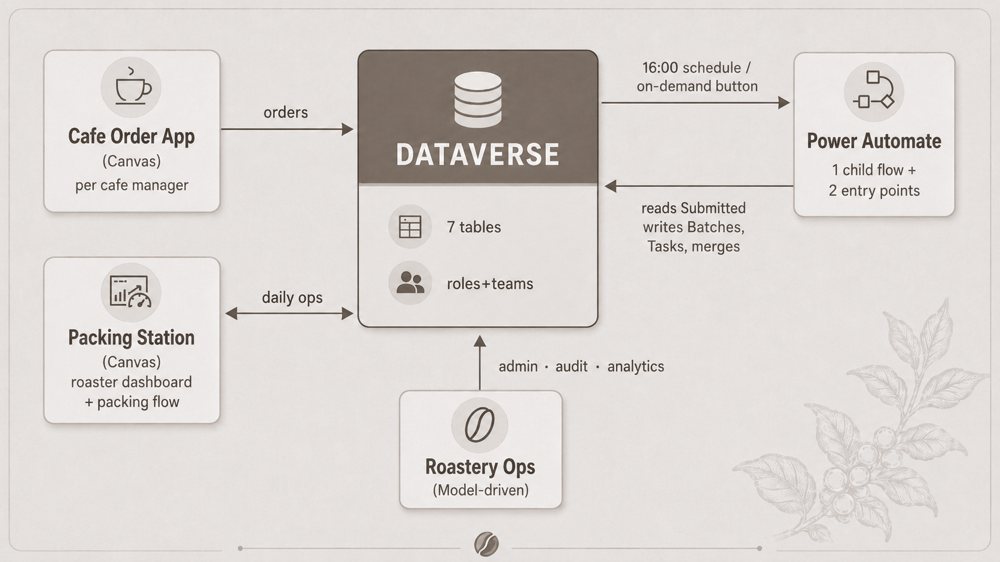

For the complete architecture, Dataverse data model and design rationale, see the [technical design](docs/technical-design.md).

**Tool choice is per scenario, not per system.** Canvas where the scenario is a purpose-built flow with no standard-UI equivalent (the order matrix; the tap-driven packing checklist). Model-driven where the need is records management — grids, forms, charts, Excel export, all generated from metadata at near-zero cost. A hybrid is the mature answer, not a compromise.

---
## Technical documentation

- [Technical design](docs/technical-design.md) — architecture, data model and design decisions.
- [Automation](docs/automation.md) — flow structure, grouping, merge logic and idempotency.
- [Security](docs/security.md) — Dataverse roles, Owner Teams and café-level isolation.
- [Production readiness](docs/production-readiness.md) — limitations, environment adaptations and licensing.
---  
## Applications

**1.5-minute walkthrough:** placing an order, building the production plan and packing completed café orders.

[Watch the video demonstration](https://youtu.be/m7cRZf3rfo8)

### Cafe Order App (canvas — cafe managers)
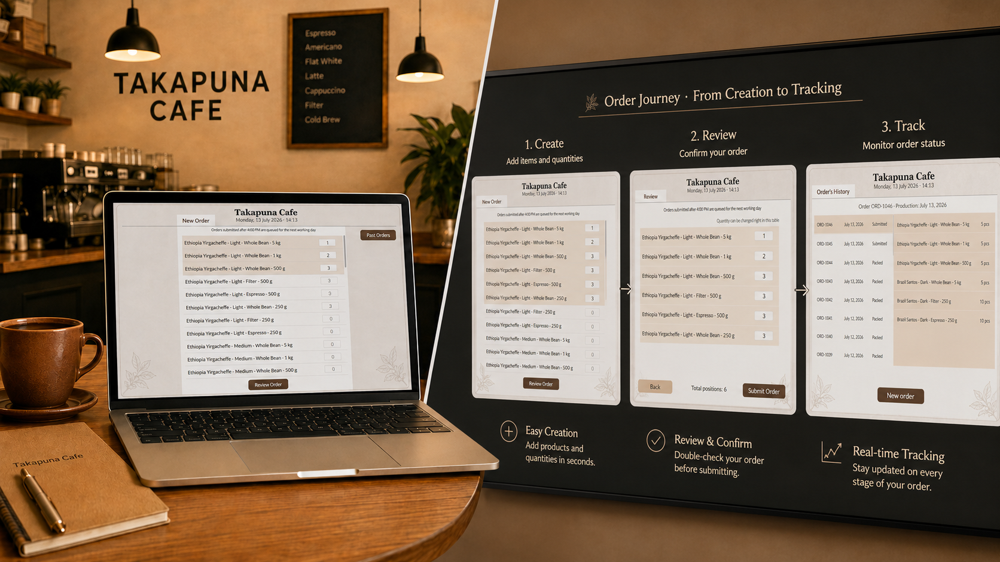
- **Order matrix**: SKU gallery with quantity inputs; quantities held in a collection (patch-on-change); submit filters `Qty > 0`.
- **Zero-trap fix**: inputs default to empty with a "0" hint and echo the stored value back (`If(ThisItem.Qty > 0, Text(ThisItem.Qty), "")`) — the "typed 2, ordered 20" cursor trap is impossible.
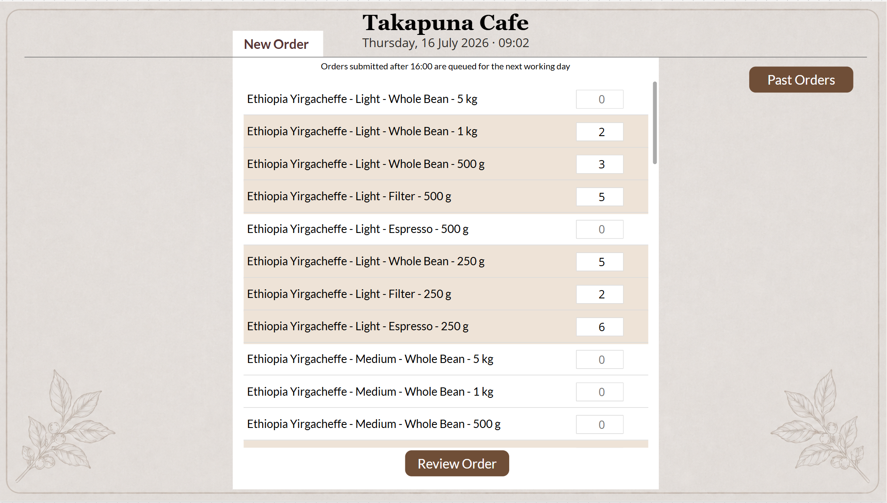
- **Submit pipeline**: 16:00 cutoff + weekend skip computes Production Date; order created via Patch; **Owner reassigned to the cafe's team** (data isolation); lines created with `ForAll … As` + GUID lookups.
- **Validation before action**: column-level constraints, submit disabled until valid — errors prevented, not caught.
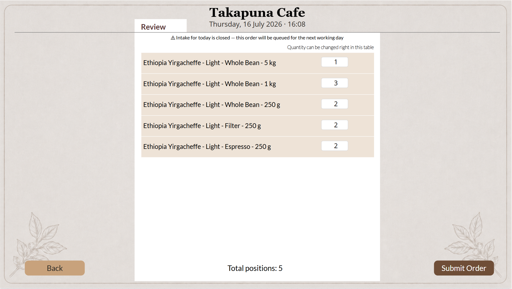
- **My Orders** — master-detail history with live status (self-service status visibility; this is why a status chatbot was rejected as redundant).
- Live clock beside the cutoff rule, with a state-aware note that switches after 16:00 from *rule* to *fact about this order*.
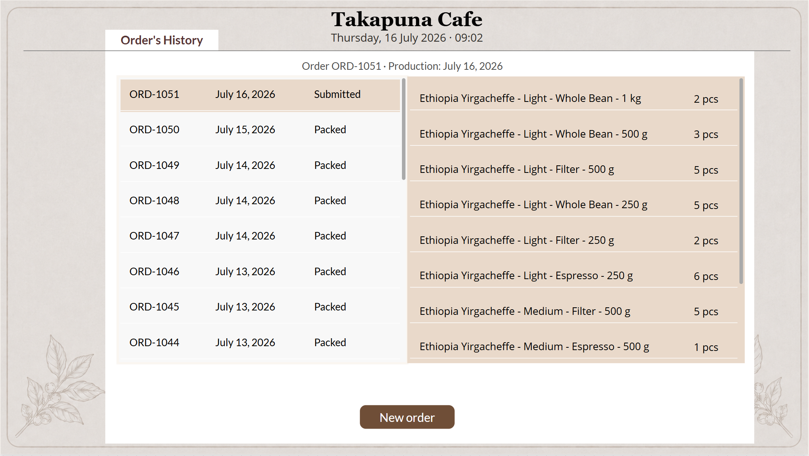

---

### Packing Station (canvas — roaster)
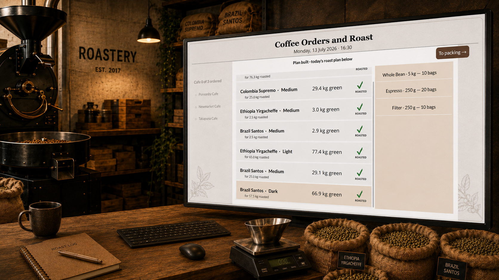
- **State-aware dashboard**: status line switches between *intake open · submitted: N* / *no orders yet* / *plan built*; the cafe checklist dims when the day is built and quiet; the build result is stamped — *"Plan built 12 Jul, 18:39 — Roast groups processed: 1, packaging tasks: 6"*.
- **The roast plan is the worklist**: today's batches **plus unfinished batches from previous days**, which surface at the top with a ⚠ date badge. **Exception handling is merged into the daily worklist** — no separate alert zone, no "check the exceptions view" procedure. Same card, same gestures; a closed tail disappears by itself. (A dedicated red zone and a warning banner were both prototyped and rejected: *"what is the operator supposed to do with a notification?"* — the worklist answers that by construction.)
- **Gesture separation** (UX rule formalised during the build): *navigation and transaction never share a hit target*. Tapping a row selects it (shows its packaging plan); the status transaction lives on a dedicated target — the "ROASTED ?" caption + circle, which answers itself on tap ("ROASTED ✔").
- **Close intake & build plan** — visible only when Submitted > 0; confirmation overlay states the consequence; calls the wrapper flow and refreshes.
- **Packing screen**: queue = orders *In Production* (date-independent); one order per screen; quantity-first line layout ("3 × Ethiopia…"); **tap-per-line** writes Pack Status; progress "Packed X of Y"; **Box ready** appears only at 100%, closes the order and auto-advances; finale "All boxes packed ☕".
- **Timer-based polling** keeps the always-open tablet dashboard fresh (canvas has no server push).
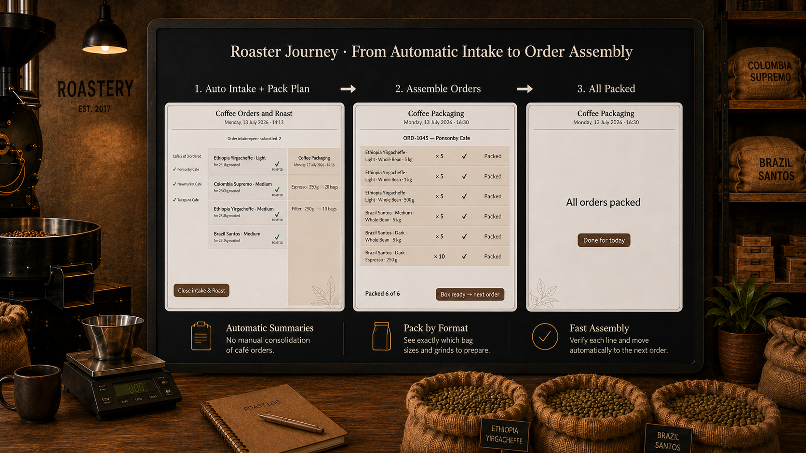

---


### Roastery Ops (model-driven — roaster + office)

What model-driven contributes, and why it earns its place:

- **Machinery from metadata**: sortable/filterable grids, search, Excel export, record forms, charts — none of it hand-built.
- **Views as cheap answers to business questions**: *Today's Roast Batches*, *Today's Packaging Plan* (related-entity filter), *Orders in Production*, **Overdue Batches** (`older than 1 day AND status ≠ Done`) — an exception view that is empty on a healthy day.
- **Charts**: *Ordered Kg by Blend*, *Bags by Package Size* — click-to-filter. (Demo data demonstrates the system's **capability to measure**, not market conclusions.)
- **Customised main form** on Roast Batch + a **Business Rule**: `IF Batch Status = Done THEN Ordered Kg is Business Required` — declarative form logic, no code.

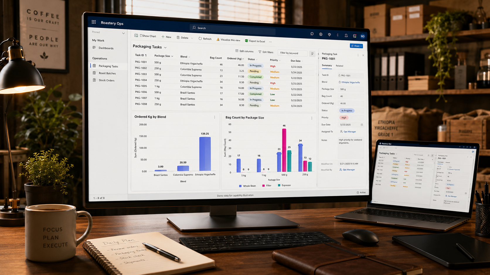
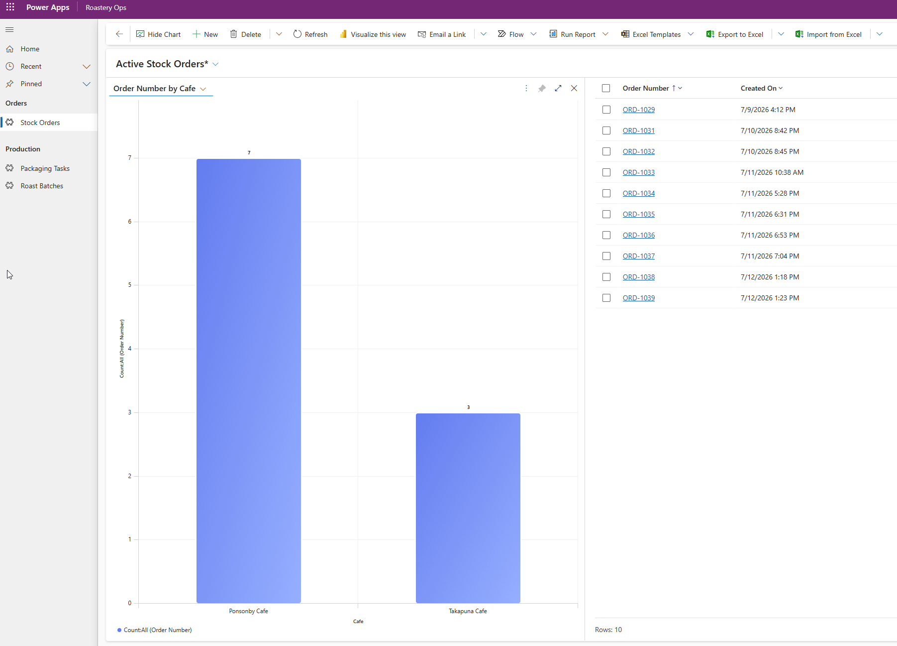
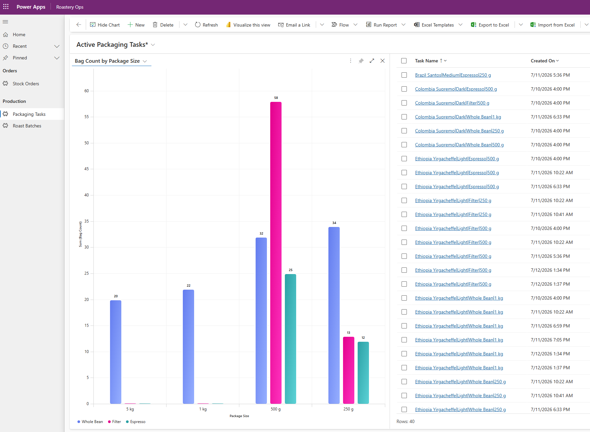
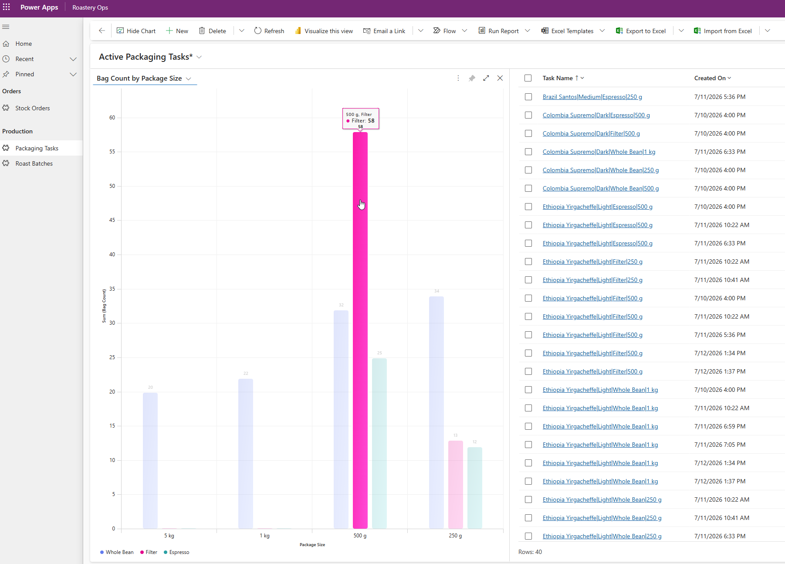
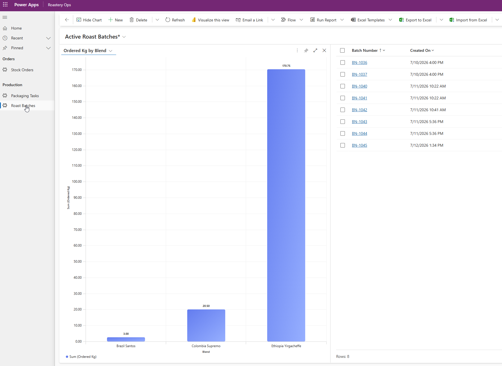

---

## Key design decisions

1. **Custom domain tables over Dynamics sales entities** — with a documented revisit trigger (billing).
2. **Tool per scenario; hybrid by design** — canvas for purpose-built flows, model-driven for records management.
3. **Copilot Studio agent evaluated and rejected** — every candidate user's questions were already served by purpose-built UI (cafes have *My Orders*; the roaster has the dashboard), and external cafes had no viable channel. Adding an agent would duplicate surfaces. (The skill is demonstrated in a separate D365 Customer Service project, where an agent has a native home.)
4. **Merge boundary = physics** — Planned batches absorb new demand; Roasting/Done are untouchable.
5. **Exception surfacing in the worklist**, not in notifications or separate zones.
6. **Per-batch tap confirmation over a bulk "close the day"** — bulk closure by date was designed, then rejected: it would blindly close a second wave nobody had roasted yet. Atomic facts beat batch ceremonies.
7. **Business Process Flow evaluated and rejected** — the process is linear with no stage decisions; a BPF here is ceremony without value.
8. **Security in data, not in app filters** — app-level filtering is UX; row-level security is the boundary.
9. **Validation before action** across both apps — constraints → contracts → DisplayMode/Visible.
10. **KPIs framed as measurement capability**, never fabricated outcomes.

---
Additional implementation details are documented in the [technical design](docs/technical-design.md). 


---
## Repository contents
```text
├── README.md
├── solution/
│   ├── CoffeeRoastery_*.zip
│   └── CoffeeRoastery_*_managed.zip
└── docs/
    ├── technical-design.md
    ├── automation.md
    ├── security.md
    ├── production-readiness.md
    └── coffee-roastery-business-case.md
```


**To deploy:** import the managed solution into a Dataverse environment, then configure connection references (Dataverse), assign the two security roles, and create Owner Teams per cafe.

---

*Built by Galina Nelyubova as a portfolio project. Fictional business, real engineering.*
