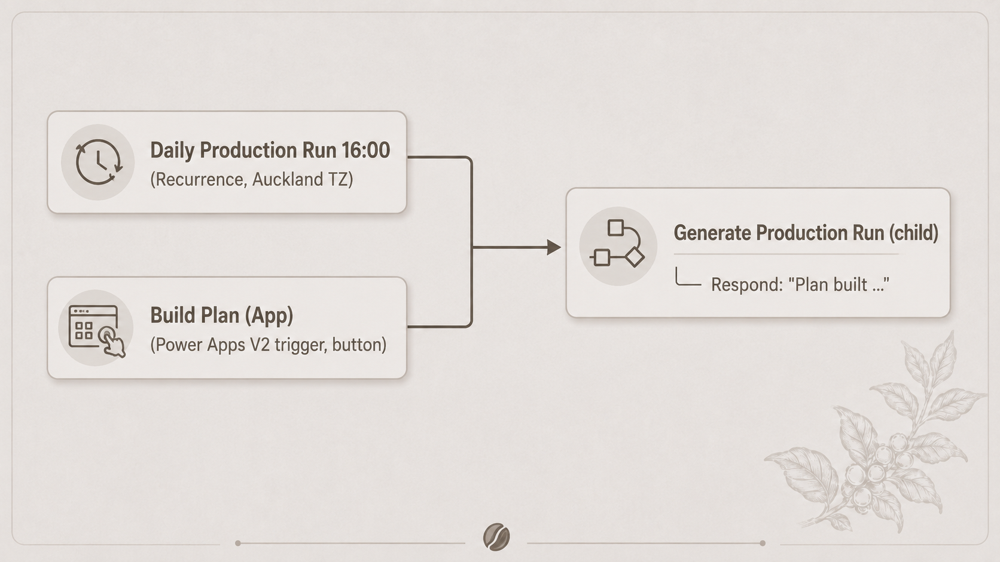
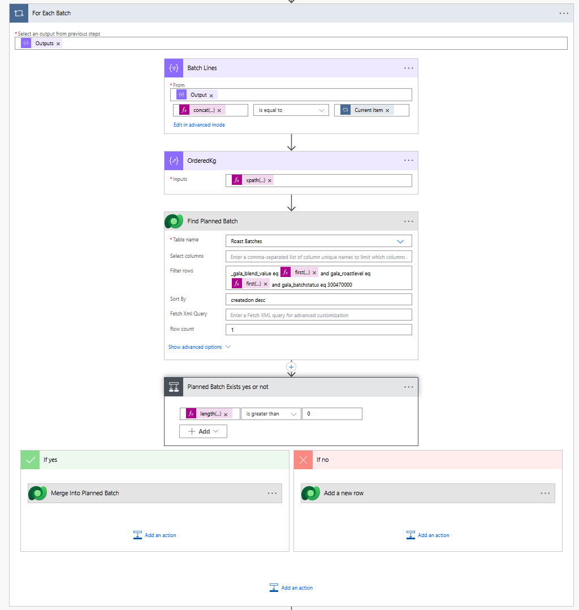

# Automation Design

This document explains how Power Automate converts submitted café orders into consolidated roasting batches and packaging tasks.

## Contents

* [Automation overview](#automation-overview)
* [Flow structure](#flow-structure)
* [Processing steps](#processing-steps)
* [Merge logic](#merge-logic)
* [Idempotency](#idempotency)
* [Production improvements](#production-improvements)

## Automation overview

The automation has one shared processing flow and two entry points:

* a scheduled flow that runs at the daily cutoff;
* a manually triggered flow that allows the roaster to close intake early.

Both parent flows call the same child flow. Business logic therefore exists in one place and does not need to be maintained separately for scheduled and manual execution.

The child flow:

1. finds submitted orders that are ready for production;
2. retrieves and flattens their order lines;
3. groups coffee demand into roasting tasks;
4. groups package demand into packaging tasks;
5. merges new demand into suitable planned work;
6. marks the processed orders as `In Production`;
7. returns a summary to the calling flow.

## Flow structure



The parent flows act only as entry points. All transformation and production-planning logic remains in the child flow.

This architecture also leaves room for another entry point—for example, an agent or an administrative action—without duplicating the underlying logic.

## Processing steps

### 1. Resolve the local business date

The flow converts the current UTC time to New Zealand time:

```text
convertTimeZone(utcNow(), 'UTC', 'New Zealand Standard Time')
```

All production-date rules are based on the local calendar rather than UTC.

### 2. Retrieve eligible orders

The flow retrieves submitted orders where:

```text
Production Date ≤ current New Zealand date
```

Orders placed after the 16:00 cutoff already carry the next eligible business date, calculated by the ordering application. The automation therefore excludes them naturally without duplicating the cutoff rule.

### 3. Retrieve and flatten order lines

Order Lines are retrieved with an Expand Query so the related coffee and shrinkage information is available in the same request.

Each line is transformed into a flat working object containing the values required by the later grouping steps.

This avoids repeated Dataverse lookups inside loops.

### 4. Build roasting groups

Demand is grouped by:

```text
Coffee or blend + roast level
```

For each distinct group, the flow:

* totals the ordered roasted weight;
* calculates the required green-bean weight;
* finds an eligible planned production task;
* updates that task or creates a new one.

### 5. Build packaging groups

Packaging demand is grouped by:

```text
Coffee or blend + roast level + grind + package size
```

The flow totals the required bag count and creates the corresponding Packaging Task against the correct production task.

### 6. Complete order processing

After production and packaging records have been created successfully, the source orders are changed from `Submitted` to `In Production`.

The flow then returns a summary such as:

```text
Roast groups processed: N, packaging tasks: M
```

The wording refers to groups processed rather than records created because a production group may have been merged into an existing task.

## Merge logic

### Problem discovered during acceptance testing

Two production-plan runs could occur on the same day:

* the roaster closes intake manually;
* the scheduled flow runs later.

A planned leftover from a previous day could also already exist.

Without merge logic, the system created two production tasks for the same coffee and roast level, even though one combined drum run would be sufficient.

Two valid rules had to be respected:

* work already being roasted must never be changed;
* compatible demand should be consolidated into one production run.

### Resolution

The merge boundary follows the physical production status:

```text
For each coffee-and-roast group:

    Find the newest production task where:
        coffee matches
        roast level matches
        status is Planned

    If a task exists:
        add the new ordered weight to the existing weight
        recalculate the required green-bean weight
        attach new packaging tasks to this production task

    Otherwise:
        create a new production task
```

Important implementation choices:

* **No production-date filter:** a planned leftover from an earlier day is still a valid merge target.
* **Planned status only:** tasks already marked `Roasting` or `Done` are excluded.
* **Newest suitable task:** sorting by creation date prevents packaging work from attaching to an older same-key task.
* **Update rather than recreate:** deleting and rebuilding a production task could cascade-delete its existing packaging tasks.



## Idempotency

The flow protects against duplicate processing at more than one level.

| Layer                 | Mechanism                                                                      | Coverage                                                                                                                                         |
| --------------------- | ------------------------------------------------------------------------------ | ------------------------------------------------------------------------------------------------------------------------------------------------ |
| Order level           | Successfully processed orders are changed from `Submitted` to `In Production`. | A repeated successful run finds no eligible orders and exits without duplicating work.                                                           |
| Production-task level | New demand merges into a compatible `Planned` task.                            | Multiple processing waves and unfinished work do not create unnecessary duplicate roasting tasks.                                                |
| Known gap             | Orders are updated only after production artifacts are created.                | A failure midway through the flow could leave orders as `Submitted` while some artifacts already exist. A rerun could duplicate those artifacts. |

The known gap is documented rather than hidden. In the portfolio implementation, the likelihood is low and the result is visible and inexpensive to correct.

## Production improvements

For a production deployment, the automation should be strengthened with one of these patterns:

### Artifact-level existence checks

Before creating each Roast Batch or Packaging Task, the flow checks whether an equivalent record already exists for the current processing run.

### Claim-first processing

Orders are moved into an intermediate processing status before artifact creation. If the flow fails, a compensation path resets or completes the affected records.

### Concurrency control

Parallel runs should be prevented or coordinated so that a scheduled and manually triggered execution cannot claim the same submitted orders simultaneously.

### Run-level traceability

A processing-run identifier should be stored against generated records. This would make troubleshooting, duplicate detection and recovery easier.

These improvements are part of the production path rather than claims about the current portfolio implementation.
