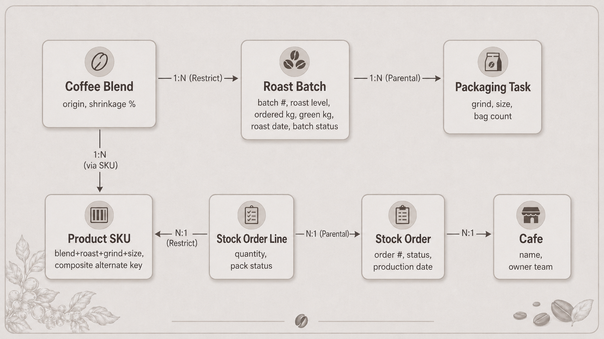

# Technical Design

This document describes the architecture, data model and key design decisions behind the Coffee Roastery Operations System.

## Contents

- [Architecture](#architecture)
- [Data model](#data-model)
- [Key design decisions](#key-design-decisions)

## Architecture

**Tool choice is per scenario, not per system.** Canvas where the scenario is a purpose-built flow with no standard-UI equivalent (the order matrix; the tap-driven packing checklist). Model-driven where the need is records management — grids, forms, charts, Excel export, all generated from metadata at near-zero cost. A hybrid is the mature answer, not a compromise.

## Data model

The model separates ordering, production planning and packing while keeping reference data reusable across all applications.

### Core transactional tables

* **Stock Order** — the café's order header, including production date, status and ownership.
* **Order Line** — the requested product and quantity for each order.
* **Roast Batch** — consolidated production demand for one coffee and roast level.
* **Packaging Task** — the required grind, package size and number of bags associated with a production task.

### Reference tables

* **Café** — the operating location and the Owner Team used for data isolation.
* **Coffee / Blend** — the coffee being roasted and its expected shrinkage percentage.
* **Product SKU** — the orderable combination of coffee, roast level, grind and package size.

### Relationship decisions

* Orders own their order lines, so deleting an order removes its dependent lines.
* Production tasks own their packaging tasks for the same reason.
* Reference records are restricted from deletion while they are in use; retirement is handled through deactivation.
* Product SKU uses a composite key to prevent duplicate orderable combinations.
* A direct batch-to-order relationship was deliberately not added because each production task consolidates demand from several orders.

The system therefore preserves clear operational ownership without introducing a junction table that no current business question requires.

---

## Key design decisions

### Custom domain tables instead of Dynamics sales entities

The solution does not require pricing, invoicing or customer billing. Using Dynamics Product Catalog and Account entities would introduce price lists, units and sales terminology into a production-planning problem.

**Revisit trigger:** franchise billing or external commercial ordering.

### A hybrid application architecture

Canvas Apps are used where the interaction is highly specialised: the product-order matrix and the tap-driven packing checklist.

The model-driven application is used for record management, filtering, forms, charts and Excel export.

The choice is based on the user scenario, not on forcing the whole system into one application type.

### Copilot Studio was evaluated and rejected

The café manager already has order history and live status. The roaster already has the production dashboard.

An agent would duplicate existing interfaces without creating a new useful interaction channel.

### The merge boundary follows the physical process

A **Planned** production task can absorb new demand. A task that is already **Roasting** or **Done** cannot be changed.

The application therefore follows the physical state of the coffee rather than an arbitrary calendar boundary.

### Exceptions remain in the worklist

Unfinished production appears in the normal daily worklist with a visible date warning.

A separate alerts screen was rejected because it would create another place the operator must remember to check.

### Individual confirmation instead of bulk closure

Each production task is confirmed separately.

A bulk “close the day” action was rejected because a second production wave might exist for the same date and could be closed without actually being roasted.

### Business Process Flow was not used

The process is linear and contains no meaningful stage choices or approval gates.

A Business Process Flow would add ceremony without improving the operator's decisions.

### Security belongs in Dataverse

Application filtering improves the interface, but it is not the security boundary.

Security roles and Owner Teams enforce café-level isolation at the data layer.

### Validation happens before submission

Both Canvas Apps prevent invalid actions through required fields, constraints and disabled controls.

The user is guided away from errors instead of receiving avoidable error messages afterwards.

### KPIs are presented as capability, not fabricated impact

The project demonstrates that the platform can measure production volume, packaging demand and overdue work.

Because the business is fictional, the case does not claim invented time savings or financial outcomes.

---

